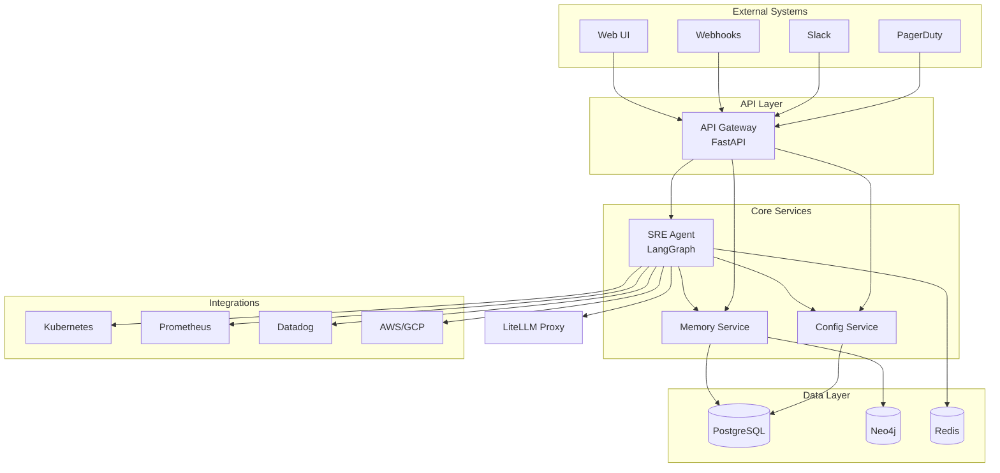
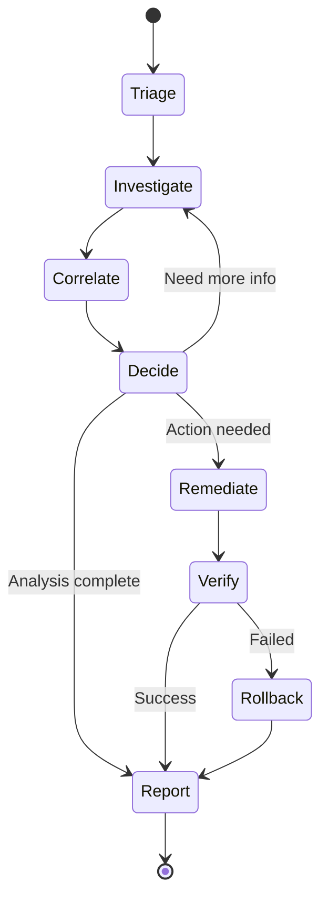
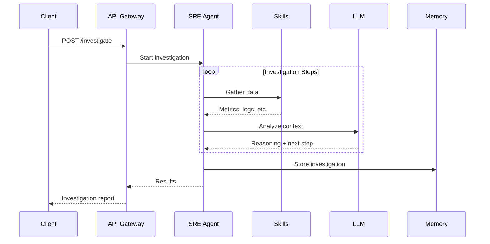
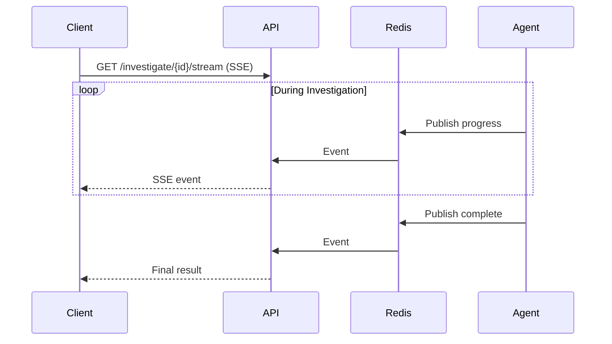

# Architecture

AutoSRE uses a microservices architecture designed for reliability, scalability, and security.

## High-Level Overview



## Components

### 1. API Gateway

**Purpose:** External interface, authentication, rate limiting

**Technology:** Python 3.12 + FastAPI

**Responsibilities:**
- REST API for all external consumers
- JWT/API key authentication
- Request validation and transformation
- Rate limiting per team/user
- SSE streaming for real-time updates

```python
# Example endpoint
@router.post("/investigate")
async def start_investigation(
    request: InvestigateRequest,
    auth: AuthContext = Depends(get_auth)
) -> InvestigateResponse:
    investigation = await agent.start(request.alert, auth.team_id)
    return InvestigateResponse(
        investigation_id=investigation.id,
        stream_url=f"/api/v1/investigate/{investigation.id}/stream"
    )
```

### 2. SRE Agent

**Purpose:** Core AI orchestration engine

**Technology:** Python 3.12 + [LangGraph](https://langchain-ai.github.io/langgraph/)

**Responsibilities:**
- Execute investigation workflows
- Invoke skills based on context
- Manage reasoning chains
- Stream progress updates



**State Schema:**

```python
class InvestigationState(TypedDict):
    # Input
    alert: AlertInfo
    team_id: str
    
    # Progress
    status: InvestigationStatus
    current_node: str
    steps: list[InvestigationStep]
    
    # Findings
    signals: list[Signal]
    correlations: list[Correlation]
    root_cause: Optional[RootCause]
    
    # Actions
    recommended_actions: list[Action]
    executed_actions: list[ActionResult]
    
    # Meta
    started_at: datetime
    duration_ms: int
```

### 3. Config Service

**Purpose:** Team configurations and integration settings

**Technology:** Python 3.12 + FastAPI + PostgreSQL

**Data Model:**

```python
class TeamConfig(BaseModel):
    team_id: str
    name: str
    
    # Autonomy: observe | suggest | auto_safe | auto_all
    autonomy: str
    
    # Enabled integrations
    integrations: list[IntegrationConfig]
    
    # Notification channels
    notifications: NotificationConfig
    
    # LLM preferences
    llm_config: LLMConfig
```

### 4. Memory Service

**Purpose:** Episodic memory for past investigations

**Technology:** Python 3.12 + PostgreSQL (pgvector) + Neo4j

**Capabilities:**
- Store investigation history
- Vector similarity search for past incidents
- Strategy extraction and ranking
- Knowledge graph queries

```sql
-- Find similar past investigations
SELECT id, alert, root_cause, resolution,
       1 - (embedding <=> $1) AS similarity
FROM investigations
WHERE team_id = $2
  AND status = 'resolved'
  AND 1 - (embedding <=> $1) > 0.75
ORDER BY embedding <=> $1
LIMIT 5;
```

### 5. Knowledge Graph

**Purpose:** Service topology and dependency mapping

**Technology:** Neo4j 5.x

**Schema:**

```cypher
// Nodes
(:Service {name, team, tier, repo})
(:Deployment {name, namespace, cluster})
(:Database {name, type, host})

// Relationships
[:DEPENDS_ON {criticality: "hard"|"soft"}]
[:DEPLOYED_AS]
[:USES_DATABASE]

// Query: What depends on payments-service?
MATCH (s:Service)-[:DEPENDS_ON*]->(p:Service {name: 'payments'})
RETURN s.name, s.team
```

### 6. LiteLLM Proxy

**Purpose:** Unified LLM interface

**Supported Providers:**
- Anthropic (Claude)
- OpenAI (GPT-4)
- Azure OpenAI
- Ollama (local)
- 100+ models via LiteLLM

## Communication Patterns

| Pattern | Use Case | Implementation |
|---------|----------|----------------|
| **Sync REST** | API queries, config | HTTP/JSON |
| **Async Events** | Investigation updates | Redis Pub/Sub |
| **SSE Streaming** | Real-time UI updates | Server-Sent Events |
| **gRPC** | High-perf internal (optional) | Protobuf |

## Data Flow

### Investigation Flow



### Real-Time Updates



## Directory Structure

```
autosre/
├── src/
│   ├── agent/           # Core AI agent
│   │   ├── graph.py     # LangGraph workflow
│   │   ├── nodes/       # Graph nodes (triage, investigate, etc.)
│   │   └── state.py     # State schema
│   ├── api/             # FastAPI application
│   │   ├── v1/          # API v1 routes
│   │   └── middleware/  # Auth, rate limiting
│   ├── config/          # Config service
│   ├── memory/          # Memory service
│   ├── integrations/    # External integrations
│   │   ├── kubernetes/
│   │   ├── prometheus/
│   │   ├── slack/
│   │   └── ...
│   └── skills/          # Tool implementations
├── charts/              # Helm charts
├── docker/              # Docker configurations
└── tests/
```

## Security Architecture

### Network Security

```
┌─────────────────────────────────────────────────────────────┐
│                    External Network                          │
│  (Load Balancer + WAF + TLS termination)                    │
└──────────────────────────┬──────────────────────────────────┘
                           │ HTTPS only
                           ▼
┌─────────────────────────────────────────────────────────────┐
│                    API Gateway                               │
│  (Authentication + Rate Limiting + CORS)                    │
└──────────────────────────┬──────────────────────────────────┘
                           │ Internal network
                           ▼
┌─────────────────────────────────────────────────────────────┐
│                    Internal Services                         │
│  (mTLS + Network policies + No public access)               │
└─────────────────────────────────────────────────────────────┘
```

### Container Security

- **Non-root containers** — All services run as non-root
- **Read-only filesystems** — Immutable container layers
- **Minimal images** — Distroless base images
- **No shell** — Reduced attack surface
- **Resource limits** — CPU/memory constraints

### Secrets Management

```yaml
# Kubernetes secrets (or Vault)
apiVersion: v1
kind: Secret
metadata:
  name: autosre-secrets
type: Opaque
data:
  anthropic-api-key: <base64>
  postgres-password: <base64>
  jwt-secret: <base64>
```

## Scalability

### Horizontal Scaling

| Component | Scaling Strategy |
|-----------|------------------|
| API Gateway | Stateless, add replicas |
| SRE Agent | Stateless, add replicas |
| Memory Service | Read replicas |
| PostgreSQL | Primary + read replicas |
| Redis | Cluster mode |
| Neo4j | Causal cluster |

### Performance Targets

| Metric | Target |
|--------|--------|
| Investigation start latency | < 1s |
| Average investigation time | < 60s |
| API P99 latency | < 100ms |
| Concurrent investigations | 100+ |

## Observability

### Metrics (Prometheus)

```python
# Investigation metrics
investigation_duration = Histogram(
    "autosre_investigation_duration_seconds",
    "Investigation duration",
    ["status", "team_id"]
)

# Skill metrics
skill_calls = Counter(
    "autosre_skill_calls_total",
    "Skill invocations",
    ["skill", "success"]
)
```

### Tracing (OpenTelemetry)

```python
with tracer.start_as_current_span("investigate") as span:
    span.set_attribute("investigation.id", inv_id)
    span.set_attribute("alert.severity", alert.severity)
    result = await run_investigation(alert)
```

### Logging

```json
{
  "timestamp": "2025-01-27T10:30:00Z",
  "level": "INFO",
  "service": "sre-agent",
  "investigation_id": "inv_01HQ...",
  "message": "Investigation started",
  "alert": {"name": "HighErrorRate", "severity": "critical"}
}
```

## Deployment Options

### Development

```bash
# Local Python
pip install -e ".[dev]"
autosre serve

# Docker Compose (full stack)
docker compose up
```

### Production (Kubernetes)

```bash
helm install autosre autosre/autosre \
  --namespace autosre \
  --values production-values.yaml
```

## Next Steps

- [Investigation Flow →](investigation-flow.md) — How investigations work
- [Memory System →](memory-system.md) — How learning works
- [Skills System →](skills.md) — Available integrations
