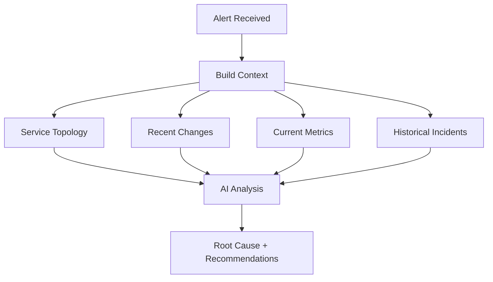

# Concepts

This section explains the core concepts and design principles behind AutoSRE.

## Overview

AutoSRE is built on three foundational ideas:

1. **Context is King** — An AI can only be as good as the context it has. AutoSRE gathers comprehensive context before making decisions.

2. **Explainable Decisions** — Every recommendation includes reasoning and evidence. No black boxes.

3. **Safe by Default** — Human approval is required for actions unless explicitly configured otherwise.

## Core Concepts

<div class="grid cards" markdown>

-   :material-sitemap:{ .lg .middle } **Architecture**

    ---

    Understand how AutoSRE's components work together

    [:octicons-arrow-right-24: Architecture](architecture.md)

-   :material-magnify:{ .lg .middle } **Investigation Flow**

    ---

    How AutoSRE investigates incidents step by step

    [:octicons-arrow-right-24: Investigation Flow](investigation-flow.md)

-   :material-brain:{ .lg .middle } **Memory System**

    ---

    How AutoSRE learns from past incidents

    [:octicons-arrow-right-24: Memory System](memory-system.md)

-   :material-tools:{ .lg .middle } **Skills System**

    ---

    The tools and integrations AutoSRE uses

    [:octicons-arrow-right-24: Skills System](skills.md)

</div>

## Key Principles

### 1. Foundation First

Before AutoSRE makes any decision, it builds a foundation of context:



### 2. Observer-Reasoner-Actor

Based on the OODA loop (Observe, Orient, Decide, Act):

| Component | Role | Example |
|-----------|------|---------|
| **Observer** | Watch for signals | Alert fires, metrics anomaly |
| **Reasoner** | Analyze and correlate | "Error rate correlates with deployment" |
| **Actor** | Execute safely | Rollback with approval |

### 3. Autonomy Levels

Control how much AutoSRE can do automatically:

| Level | Description | Use Case |
|-------|-------------|----------|
| `observe` | Report only, never act | Initial deployment, learning |
| `suggest` | Recommend with approval | Production with oversight |
| `auto_safe` | Auto-execute low-risk actions | Trusted environments |
| `auto_all` | Full autonomy | Testing only |

### 4. Guardrails

Every action passes through safety checks:

- **Blast Radius** — Limits scope of impact
- **Tier Protection** — Higher tiers need approval
- **Rate Limiting** — Prevents runaway automation
- **Audit Trail** — Everything is logged

## The Investigation Lifecycle

```
┌─────────────────────────────────────────────────────────────┐
│                    TRIAGE (seconds)                         │
│  • Classify alert severity                                  │
│  • Identify affected services                               │
│  • Check if known issue                                     │
└─────────────────────────────────────────────────────────────┘
                              ↓
┌─────────────────────────────────────────────────────────────┐
│                  INVESTIGATE (minutes)                       │
│  • Gather metrics, logs, traces                             │
│  • Check recent deployments                                 │
│  • Query knowledge graph                                    │
│  • Search similar past incidents                            │
└─────────────────────────────────────────────────────────────┘
                              ↓
┌─────────────────────────────────────────────────────────────┐
│                   CORRELATE (seconds)                        │
│  • Find patterns across signals                             │
│  • Match with known failure modes                           │
│  • Calculate confidence scores                              │
└─────────────────────────────────────────────────────────────┘
                              ↓
┌─────────────────────────────────────────────────────────────┐
│                   REMEDIATE (optional)                       │
│  • Propose actions                                          │
│  • Request approval (if needed)                             │
│  • Execute with rollback support                            │
│  • Verify resolution                                        │
└─────────────────────────────────────────────────────────────┘
                              ↓
┌─────────────────────────────────────────────────────────────┐
│                    LEARN (continuous)                        │
│  • Store investigation for future reference                 │
│  • Update strategy rankings                                 │
│  • Refine knowledge graph                                   │
└─────────────────────────────────────────────────────────────┘
```

## Why This Approach?

### vs Traditional Runbooks

| Aspect | Runbooks | AutoSRE |
|--------|----------|---------|
| **Adaptability** | Static decision trees | Dynamic, context-aware |
| **Maintenance** | Manual updates | Self-improving |
| **Coverage** | Known scenarios only | Novel incidents too |
| **Context** | Limited | Full observability stack |

### vs Other AIOps

| Aspect | Typical AIOps | AutoSRE |
|--------|---------------|---------|
| **Reasoning** | Pattern matching | LLM-based analysis |
| **Explainability** | Black box | Full reasoning chain |
| **Actions** | Limited | Rich skill library |
| **Learning** | Vendor-controlled | Your data, your models |

## Next Steps

Dive deeper into each concept:

- [Architecture →](architecture.md)
- [Investigation Flow →](investigation-flow.md)
- [Memory System →](memory-system.md)
- [Skills System →](skills.md)
