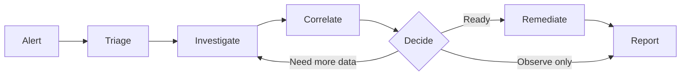
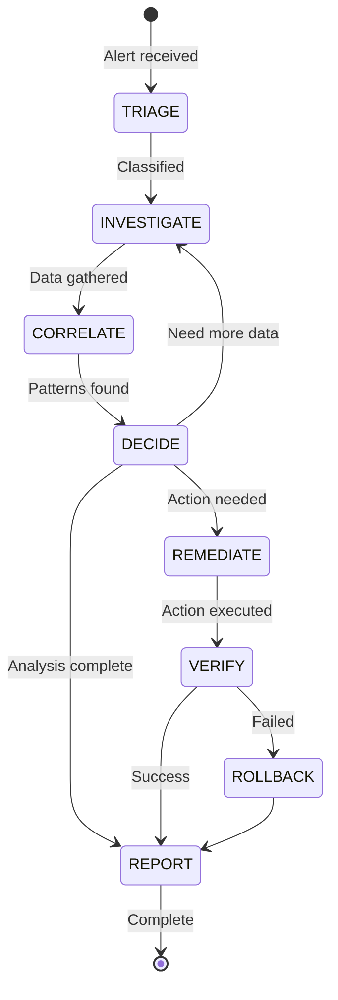
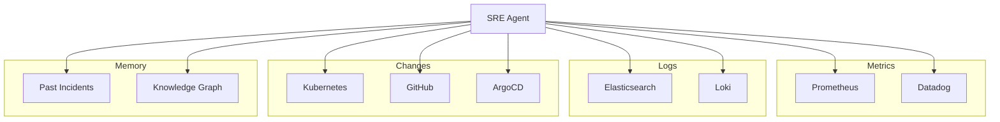
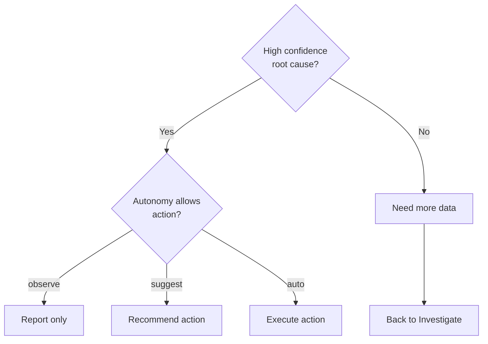
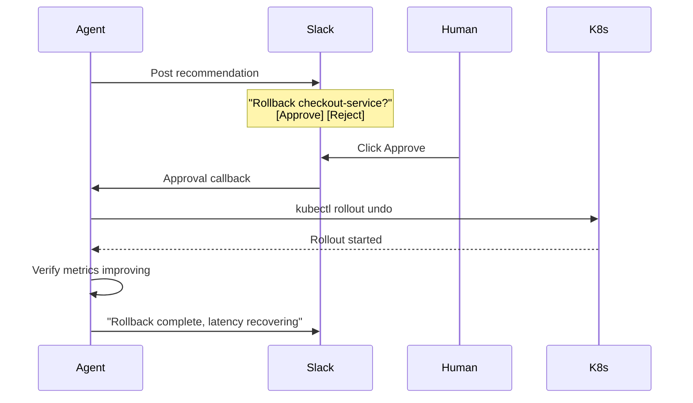

# Investigation Flow

This document explains how AutoSRE investigates incidents, from alert reception to resolution.

## Overview

An investigation follows a structured flow built on [LangGraph](https://langchain-ai.github.io/langgraph/), ensuring reliable, auditable reasoning:



## The Investigation State Machine



## Phase 1: Triage (Seconds)

**Goal:** Quickly classify the alert and determine investigation scope.

### What Happens

1. **Parse alert** — Extract service, namespace, severity
2. **Check deduplication** — Is this a known ongoing incident?
3. **Load context** — Fetch service topology and ownership
4. **Initial classification** — Critical, warning, or informational?

### Example

```python
class TriageNode:
    async def run(self, state: InvestigationState) -> InvestigationState:
        alert = state["alert"]
        
        # Check for ongoing incidents
        existing = await self.memory.find_active_investigation(
            service=alert.labels.get("service"),
            window_minutes=30
        )
        if existing:
            return state.merge(status="deduplicated", link_to=existing.id)
        
        # Load service context
        service = await self.context.get_service(alert.labels.get("service"))
        
        # Initial classification
        classification = await self.llm.classify(
            alert=alert,
            service=service,
            template="triage"
        )
        
        return state.merge(
            classification=classification,
            affected_services=[service] + service.dependencies,
            priority=classification.priority
        )
```

### Output

```yaml
classification:
  type: performance
  severity: critical
  blast_radius: medium
affected_services:
  - checkout-service (primary)
  - payments-api (dependency)
  - orders-db (database)
priority: P1
```

---

## Phase 2: Investigate (Minutes)

**Goal:** Gather comprehensive context from all available sources.

### What Happens

1. **Metrics collection** — Latency, errors, traffic patterns
2. **Log analysis** — Error messages, stack traces
3. **Recent changes** — Deployments, config changes
4. **Dependency check** — Upstream/downstream health
5. **Historical search** — Similar past incidents

### Data Sources



### Skills Invoked

| Skill | Purpose | Example Call |
|-------|---------|--------------|
| `kubernetes.get_deployment` | Current state | Replicas, events |
| `prometheus.query_range` | Metrics | Error rate over time |
| `elasticsearch.search` | Logs | Recent errors |
| `github.recent_deployments` | Changes | Last 24h deploys |
| `memory.similar_incidents` | History | Past P1s |

### Example Output

```yaml
signals:
  - source: prometheus
    type: metric
    name: http_request_duration_seconds
    value: 4.2  # P99 latency
    baseline: 0.12
    deviation: 35x
    
  - source: kubernetes
    type: event
    name: Deployment rollout
    timestamp: 2025-01-27T10:15:00Z
    details: checkout-service v2.3.0 → v2.3.1
    
  - source: elasticsearch
    type: log
    name: Database connection timeout
    count: 1247
    sample: "Connection pool exhausted, waited 15s"
    
  - source: memory
    type: similar_incident
    id: inv_20241215_001
    similarity: 0.89
    root_cause: "DB connection pool exhaustion"
    resolution: "Increased pool size"
```

---

## Phase 3: Correlate (Seconds)

**Goal:** Find patterns and connections across collected signals.

### What Happens

1. **Temporal correlation** — What changed when symptoms started?
2. **Dependency correlation** — Are dependencies affected too?
3. **Pattern matching** — Match against known failure modes
4. **Confidence scoring** — How sure are we?

### Correlation Logic

```python
class CorrelateNode:
    async def run(self, state: InvestigationState) -> InvestigationState:
        signals = state["signals"]
        
        # Find temporal correlations
        symptom_start = self.find_symptom_start(signals)
        changes_before = [s for s in signals 
                        if s.type == "change" 
                        and s.timestamp < symptom_start
                        and s.timestamp > symptom_start - timedelta(hours=1)]
        
        # Check dependencies
        dependency_issues = [s for s in signals
                           if s.source in state["affected_services"]
                           and s.deviation > 2]
        
        # Match against failure patterns
        pattern_matches = await self.patterns.match(signals)
        
        # Build correlations
        correlations = self.build_correlations(
            changes_before,
            dependency_issues,
            pattern_matches
        )
        
        return state.merge(correlations=correlations)
```

### Example Correlation

```yaml
correlations:
  - type: change_correlation
    confidence: 0.92
    change:
      type: deployment
      service: checkout-service
      version: v2.3.0 → v2.3.1
      timestamp: 2025-01-27T10:15:00Z
    symptoms:
      - latency_spike (started 10:17)
      - db_connection_errors (started 10:18)
    analysis: "Latency spike started 2 minutes after deployment"
    
  - type: dependency_correlation
    confidence: 0.85
    upstream: checkout-service
    downstream: orders-db
    pattern: "Connection pool exhaustion"
    evidence:
      - db_wait_time: 15s
      - active_connections: 50/50
```

---

## Phase 4: Decide (Seconds)

**Goal:** Determine root cause and decide on action.

### Decision Tree



### Root Cause Analysis

```python
class DecideNode:
    async def run(self, state: InvestigationState) -> InvestigationState:
        correlations = state["correlations"]
        past_incidents = state["similar_incidents"]
        
        # Build analysis prompt
        prompt = self.build_prompt(
            alert=state["alert"],
            signals=state["signals"],
            correlations=correlations,
            past_incidents=past_incidents
        )
        
        # Get LLM analysis
        analysis = await self.llm.analyze(prompt)
        
        # Validate confidence
        if analysis.confidence < 0.7:
            return state.merge(
                status="investigating",
                next_node="investigate",
                additional_checks=analysis.suggested_checks
            )
        
        # Determine actions
        actions = self.recommend_actions(
            analysis.root_cause,
            state["team_config"].autonomy
        )
        
        return state.merge(
            root_cause=analysis.root_cause,
            confidence=analysis.confidence,
            recommended_actions=actions,
            reasoning=analysis.reasoning
        )
```

### Example Analysis

```yaml
root_cause:
  summary: "Database connection pool exhaustion"
  confidence: 0.92
  reasoning: |
    1. Deployment checkout-service v2.3.1 occurred at 10:15
    2. Latency spike started at 10:17 (2 min after)
    3. New query in v2.3.1 holds connections longer
    4. Pool exhausted (50/50 connections active)
    5. Subsequent requests waiting 15s for connections
    6. Past incident inv_20241215_001 had identical pattern
    
evidence:
  - Correlation with deployment (92% confidence)
  - DB connection metrics match known failure pattern
  - Similar incident resolved with pool increase

recommended_actions:
  - action: rollback
    command: kubectl rollout undo deployment/checkout-service
    risk: low
    reversible: true
    
  - action: scale_pool
    command: kubectl set env deployment/checkout-service DB_POOL_SIZE=100
    risk: medium
    reversible: true
```

---

## Phase 5: Remediate (If Approved)

**Goal:** Execute remediation safely.

### Approval Flow



### Execution with Guardrails

```python
class RemediateNode:
    async def run(self, state: InvestigationState) -> InvestigationState:
        action = state["recommended_actions"][0]
        
        # Check guardrails
        guardrail_result = await self.guardrails.check(action)
        if not guardrail_result.allowed:
            return state.merge(
                action_blocked=True,
                block_reason=guardrail_result.reason
            )
        
        # Check if approval needed
        if self.requires_approval(action, state["team_config"]):
            approval = await self.request_approval(action)
            if not approval.granted:
                return state.merge(action_rejected=True)
        
        # Execute with rollback support
        try:
            result = await self.execute(action)
            
            # Verify improvement
            verified = await self.verify(action, timeout=120)
            if not verified:
                await self.rollback(action)
                return state.merge(action_failed=True)
                
            return state.merge(
                action_executed=True,
                action_result=result
            )
        except Exception as e:
            await self.rollback(action)
            raise
```

### Guardrails

| Guardrail | Description |
|-----------|-------------|
| **Blast Radius** | Max pods/services affected |
| **Tier Protection** | P0 services need approval |
| **Time Windows** | No changes during blackouts |
| **Rate Limiting** | Max actions per hour |
| **Dry Run** | Simulate before executing |

---

## Phase 6: Report (Always)

**Goal:** Generate human-readable summary.

### Report Format

```
╭─────────────────────────────────────────────────────────────╮
│                    🔍 Investigation Report                   │
├─────────────────────────────────────────────────────────────┤
│ ID: inv_01HQ7X9A2B3C4D5E6F                                  │
│ Alert: High latency on checkout-service                     │
│ Duration: 47 seconds                                        │
│ Status: ✅ Resolved                                          │
├─────────────────────────────────────────────────────────────┤
│ 🎯 Root Cause (confidence: 92%)                             │
│                                                             │
│ Database connection pool exhaustion caused by a new query   │
│ introduced in deployment checkout-v2.3.1, deployed at       │
│ 10:15. The query holds connections 10x longer than before.  │
├─────────────────────────────────────────────────────────────┤
│ 📊 Evidence:                                                │
│ • P99 latency: 4.2s → 120ms (after fix)                    │
│ • DB connection wait: 15s → 10ms                           │
│ • Deployment correlation: 92% confidence                   │
│ • Similar past incident: inv_20241215_001                  │
├─────────────────────────────────────────────────────────────┤
│ ✅ Action Taken:                                             │
│ kubectl rollout undo deployment/checkout-service           │
│ Approved by: @oncall-engineer                              │
│ Executed at: 10:32                                         │
│ Verified at: 10:34 (metrics recovered)                     │
├─────────────────────────────────────────────────────────────┤
│ 📝 Recommendations:                                          │
│ • Review PR #1234 for connection handling                  │
│ • Consider increasing connection pool permanently          │
│ • Add connection pool metrics to dashboard                 │
╰─────────────────────────────────────────────────────────────╯
```

---

## Customizing the Flow

### Skip Nodes

```yaml
# Skip remediation (observe only)
agent:
  autonomy: observe
```

### Add Custom Nodes

```python
# Custom pre-investigation step
@graph.node
async def security_check(state: InvestigationState) -> InvestigationState:
    """Check for security-related alerts."""
    if "security" in state["alert"].labels:
        # Special handling for security alerts
        await notify_security_team(state["alert"])
    return state

# Add to graph
graph.add_edge("triage", "security_check")
graph.add_edge("security_check", "investigate")
```

### Custom Skills

```python
# Add custom data source
@skill("my_apm.get_traces")
async def get_traces(service: str, time_range: str) -> list[Trace]:
    """Fetch traces from custom APM."""
    return await my_apm_client.query(service, time_range)
```

---

## Next Steps

- [Memory System →](memory-system.md) — How AutoSRE learns from investigations
- [Skills System →](skills.md) — Available tools and integrations
- [Custom Skills →](../guides/custom-skills.md) — Add your own integrations
