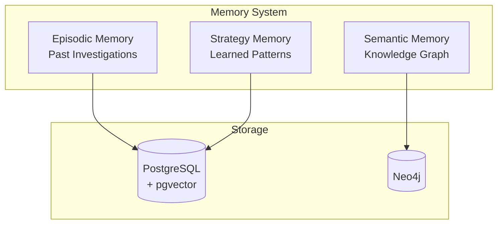
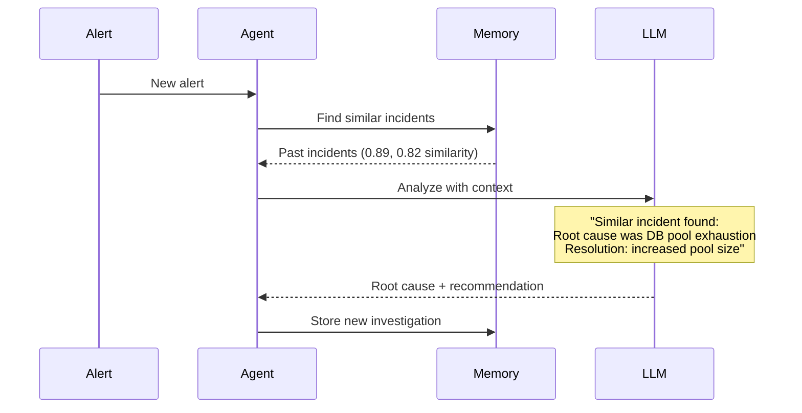

# Memory System

AutoSRE's memory system enables learning from past incidents, improving investigation accuracy over time.

## Overview

The memory system has three components:



1. **Episodic Memory** — Stores every investigation with full context
2. **Semantic Memory** — Service topology and relationships (knowledge graph)
3. **Strategy Memory** — Learned investigation patterns and their effectiveness

## Episodic Memory

### What's Stored

Every investigation is stored with:

```python
class Investigation(BaseModel):
    id: str
    team_id: str
    created_at: datetime
    completed_at: datetime | None
    
    # Trigger
    alert: AlertInfo
    
    # Execution
    status: InvestigationStatus
    steps: list[InvestigationStep]
    
    # Results
    root_cause: str | None
    confidence: float
    resolution: str | None
    
    # Feedback
    was_correct: bool | None  # User feedback
    human_notes: str | None
    
    # Embeddings for similarity search
    embedding: list[float]  # 1536 dimensions
    
    # Tags for filtering
    tags: list[str]
```

### Vector Similarity Search

When a new alert arrives, AutoSRE searches for similar past incidents:

```python
async def find_similar_investigations(
    alert: AlertInfo,
    team_id: str,
    min_similarity: float = 0.75,
    limit: int = 5
) -> list[SimilarIncident]:
    # Generate embedding for current alert
    embedding = await embed(alert.to_text())
    
    # Vector search with pgvector
    results = await db.execute("""
        SELECT 
            id, alert, root_cause, resolution,
            1 - (embedding <=> $1) AS similarity
        FROM investigations
        WHERE team_id = $2
          AND status = 'resolved'
          AND was_correct IS NOT FALSE
          AND 1 - (embedding <=> $1) > $3
        ORDER BY embedding <=> $1
        LIMIT $4
    """, embedding, team_id, min_similarity, limit)
    
    return [SimilarIncident(**r) for r in results]
```

### How It's Used



### Example Query

```yaml
# Current alert
alert:
  name: HighLatency
  service: checkout-service
  severity: critical

# Found similar incident
similar_incident:
  id: inv_20241215_001
  similarity: 0.89
  alert:
    name: HighLatency
    service: checkout-service
    severity: critical
  root_cause: "Database connection pool exhaustion"
  resolution: "Increased pool size from 50 to 100"
  was_correct: true
  time_to_resolve: 15 minutes
```

---

## Semantic Memory (Knowledge Graph)

### Service Topology

The knowledge graph stores service relationships:

```cypher
// Services and dependencies
(:Service {name: "checkout-service", team: "payments", tier: 1})
  -[:DEPENDS_ON {criticality: "hard"}]->
(:Service {name: "payments-api"})
  -[:USES_DATABASE]->
(:Database {name: "orders-db", type: "postgresql"})

// Deployment relationships
(:Service {name: "checkout-service"})
  -[:DEPLOYED_AS]->
(:Deployment {name: "checkout-service", namespace: "production"})
```

### Queries

**What depends on this service?**

```cypher
MATCH (s:Service)-[:DEPENDS_ON*]->(target:Service {name: $service})
RETURN s.name, s.team, s.tier
```

**Blast radius for a database outage:**

```cypher
MATCH (db:Database {name: $db_name})<-[:USES_DATABASE]-(s:Service)
OPTIONAL MATCH (upstream:Service)-[:DEPENDS_ON*]->(s)
RETURN s.name AS direct_impact,
       collect(DISTINCT upstream.name) AS indirect_impact
```

**On-call for affected services:**

```cypher
MATCH (s:Service {name: $service})-[:OWNED_BY]->(t:Team)
RETURN t.name, t.slack_channel, t.oncall_schedule
```

### Auto-Discovery

The graph is populated automatically from:

| Source | Discovered |
|--------|-----------|
| Kubernetes | Deployments, services, namespaces |
| Prometheus | Service dependencies (via metrics) |
| GitHub | Repository ownership |
| Service mesh | Traffic flow, dependencies |

```python
class KubernetesDiscovery:
    async def sync(self):
        # Get all deployments
        deployments = await self.k8s.list_deployments()
        
        for dep in deployments:
            # Create/update service node
            await self.graph.merge_service(
                name=dep.name,
                namespace=dep.namespace,
                labels=dep.labels
            )
            
            # Discover dependencies from env vars
            for env in dep.spec.env:
                if "_SERVICE_HOST" in env.name:
                    dependency = env.name.replace("_SERVICE_HOST", "").lower()
                    await self.graph.merge_dependency(
                        from_service=dep.name,
                        to_service=dependency
                    )
```

---

## Strategy Memory

### What's a Strategy?

A strategy is a learned pattern for investigating specific types of incidents:

```python
class Strategy(BaseModel):
    id: str
    name: str
    description: str
    
    # When to apply
    triggers: list[StrategyTrigger]
    
    # What to do
    steps: list[StrategyStep]
    
    # Effectiveness
    success_rate: float
    times_used: int
    avg_resolution_time_seconds: int
```

### Example Strategies

**High Latency Investigation:**

```yaml
name: high_latency_investigation
description: "Standard investigation for latency spikes"

triggers:
  - alert_name_contains: ["latency", "slow", "timeout"]
  - metric_type: latency

steps:
  - action: check_recent_deployments
    priority: 1
    rationale: "Latency issues often correlate with recent changes"
    
  - action: query_latency_breakdown
    priority: 2
    query: "histogram_quantile(0.99, rate(http_duration_bucket[5m]))"
    
  - action: check_database_connections
    priority: 3
    rationale: "Database issues are common cause of latency"
    
  - action: check_downstream_services
    priority: 4
    rationale: "Dependency issues can propagate latency"

success_rate: 0.82
times_used: 47
avg_resolution_time_seconds: 180
```

**OOMKilled Investigation:**

```yaml
name: oom_investigation
description: "Investigation for out-of-memory crashes"

triggers:
  - alert_name_contains: ["OOMKilled", "memory"]
  - event_reason: OOMKilled

steps:
  - action: get_container_resources
    priority: 1
    rationale: "Check memory limits vs usage"
    
  - action: check_memory_trend
    priority: 2
    query: "container_memory_usage_bytes / container_spec_memory_limit_bytes"
    
  - action: check_recent_deployments
    priority: 3
    rationale: "Memory leaks often introduced in deployments"
    
  - action: get_heap_profile
    priority: 4
    rationale: "If available, analyze memory allocation"

success_rate: 0.91
times_used: 23
avg_resolution_time_seconds: 240
```

### Strategy Selection

```python
async def select_strategy(alert: AlertInfo) -> Strategy | None:
    # Match triggers
    candidates = await db.query("""
        SELECT * FROM strategies
        WHERE EXISTS (
            SELECT 1 FROM strategy_triggers t
            WHERE t.strategy_id = strategies.id
              AND (
                  $1 ILIKE '%' || t.alert_name_pattern || '%'
                  OR t.metric_type = $2
              )
        )
        ORDER BY success_rate DESC, times_used DESC
        LIMIT 5
    """, alert.name, alert.metric_type)
    
    if not candidates:
        return None
    
    # Use LLM to pick best match
    best = await llm.select_strategy(alert, candidates)
    return best
```

### Strategy Learning

After each investigation, strategies are updated:

```python
async def update_strategy_stats(
    investigation: Investigation,
    strategy: Strategy
):
    # Update success rate
    was_successful = (
        investigation.status == "resolved" and
        investigation.was_correct is not False
    )
    
    await db.execute("""
        UPDATE strategies
        SET times_used = times_used + 1,
            success_rate = (
                success_rate * times_used + $2
            ) / (times_used + 1),
            avg_resolution_time_seconds = (
                avg_resolution_time_seconds * times_used + $3
            ) / (times_used + 1)
        WHERE id = $1
    """, strategy.id, 1 if was_successful else 0, 
        investigation.duration_seconds)
```

---

## Feedback Loop

Human feedback improves the memory system:

### Marking Investigations

```bash
# Via CLI
autosre feedback inv_01HQ... --correct
autosre feedback inv_01HQ... --incorrect --note "Root cause was actually X"

# Via Slack
# Click the 👍 or 👎 buttons on investigation reports
```

### How Feedback Is Used

| Feedback | Effect |
|----------|--------|
| ✅ Correct | Boosts investigation in similarity search |
| ❌ Incorrect | Excludes from similarity search |
| 📝 Notes | Added to investigation context |

```python
async def apply_feedback(
    investigation_id: str,
    was_correct: bool,
    notes: str | None
):
    await db.execute("""
        UPDATE investigations
        SET was_correct = $2,
            human_notes = $3,
            feedback_at = NOW()
        WHERE id = $1
    """, investigation_id, was_correct, notes)
    
    # If incorrect, adjust strategy stats
    if not was_correct:
        await downgrade_strategy(investigation_id)
```

---

## Data Retention

Configure how long data is kept:

```yaml
memory:
  retention:
    # Investigation records
    investigations: 90  # days
    
    # Change events
    changes: 30  # days
    
    # Alerts (raw)
    alerts: 7  # days
    
    # Embeddings
    embeddings: 365  # days
```

### Cleanup Job

```python
async def cleanup_old_data():
    cutoff = datetime.now() - timedelta(days=config.retention.investigations)
    
    await db.execute("""
        DELETE FROM investigations
        WHERE completed_at < $1
          AND was_correct IS NOT TRUE  -- Keep correct ones longer
    """, cutoff)
```

---

## Privacy & Security

### Data Isolation

- Each team's data is isolated by `team_id`
- No cross-team queries unless explicitly shared
- API keys scoped to team

### Sensitive Data

```yaml
memory:
  # Don't store these fields
  exclude_fields:
    - secrets
    - passwords
    - tokens
    - api_keys
  
  # Redact patterns
  redact_patterns:
    - "password=.*"
    - "token=.*"
    - "Bearer .*"
```

### Local-Only Option

For sensitive environments, disable cloud features:

```yaml
llm:
  provider: ollama  # Local LLM
  
memory:
  embeddings:
    provider: local  # Local embedding model
    model: all-MiniLM-L6-v2
```

---

## Metrics

Track memory system effectiveness:

```python
# Similarity search metrics
memory_search_duration = Histogram(
    "autosre_memory_search_seconds",
    "Time to search similar incidents"
)

memory_search_results = Histogram(
    "autosre_memory_search_results",
    "Number of similar incidents found"
)

# Strategy metrics
strategy_success = Counter(
    "autosre_strategy_success_total",
    "Strategy outcomes",
    ["strategy", "outcome"]
)
```

---

## Next Steps

- [Skills System →](skills.md) — Tools that generate investigation data
- [Custom Skills →](../guides/custom-skills.md) — Add your own data sources
- [Configuration →](../getting-started/configuration.md) — Configure memory settings
