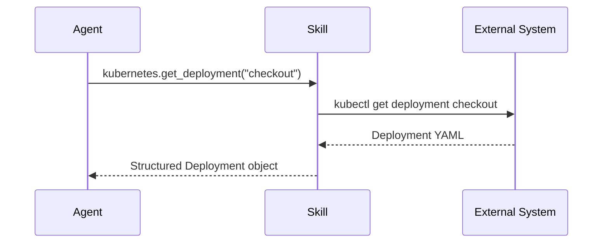

# Skills System

Skills are the tools AutoSRE uses to gather data and take actions. This document explains how skills work and lists all available skills.

## Overview

Skills provide a standardized interface for external systems:

```python
@skill("kubernetes.get_deployment")
async def get_deployment(
    name: str,
    namespace: str = "default"
) -> Deployment:
    """Get deployment details from Kubernetes."""
    return await k8s_client.get_deployment(name, namespace)
```

When the SRE Agent needs information, it calls skills:



## Skill Categories

AutoSRE includes 46+ skills organized by category:

| Category | Skills | Purpose |
|----------|--------|---------|
| [Kubernetes](#kubernetes) | 12 | Cluster state, deployments, logs |
| [Prometheus](#prometheus) | 6 | Metrics, alerts |
| [Cloud (AWS/GCP/Azure)](#cloud) | 15 | Cloud resources, services |
| [Logs](#logs) | 5 | Log search, analysis |
| [APM](#apm) | 4 | Traces, performance |
| [Incidents](#incidents) | 3 | PagerDuty, OpsGenie |
| [Chat](#chat) | 2 | Slack, Teams |
| [CI/CD](#cicd) | 4 | GitHub, GitLab, ArgoCD |

---

## Kubernetes

### kubernetes.get_deployment

Get deployment details.

```python
result = await kubernetes.get_deployment(
    name="checkout-service",
    namespace="production"
)

# Returns:
{
    "name": "checkout-service",
    "namespace": "production",
    "replicas": {"desired": 3, "ready": 3, "available": 3},
    "image": "checkout:v2.3.1",
    "conditions": [...],
    "events": [...]
}
```

### kubernetes.get_pods

List pods with optional filtering.

```python
result = await kubernetes.get_pods(
    namespace="production",
    label_selector="app=checkout-service",
    field_selector="status.phase!=Running"  # Only non-running
)
```

### kubernetes.get_pod_logs

Fetch container logs.

```python
result = await kubernetes.get_pod_logs(
    name="checkout-service-abc123",
    namespace="production",
    container="main",
    tail_lines=100,
    since_seconds=300  # Last 5 minutes
)
```

### kubernetes.get_events

Get cluster events.

```python
result = await kubernetes.get_events(
    namespace="production",
    involved_object_name="checkout-service",
    reason="Failed"  # Filter by reason
)
```

### kubernetes.describe_pod

Get detailed pod information.

```python
result = await kubernetes.describe_pod(
    name="checkout-service-abc123",
    namespace="production"
)

# Returns:
{
    "name": "checkout-service-abc123",
    "status": "Running",
    "containers": [...],
    "resources": {"requests": {...}, "limits": {...}},
    "events": [...],
    "conditions": [...]
}
```

### kubernetes.get_hpa

Get HorizontalPodAutoscaler status.

```python
result = await kubernetes.get_hpa(
    name="checkout-service",
    namespace="production"
)
```

### kubernetes.rollout_status

Check rollout status.

```python
result = await kubernetes.rollout_status(
    kind="deployment",
    name="checkout-service",
    namespace="production"
)
```

### kubernetes.rollout_undo ⚠️

Rollback a deployment. **Requires approval**.

```python
result = await kubernetes.rollout_undo(
    kind="deployment",
    name="checkout-service",
    namespace="production",
    to_revision=5  # Optional: specific revision
)
```

### kubernetes.scale ⚠️

Scale a deployment. **Requires approval**.

```python
result = await kubernetes.scale(
    kind="deployment",
    name="checkout-service",
    namespace="production",
    replicas=5
)
```

### kubernetes.get_configmap

Get ConfigMap contents.

```python
result = await kubernetes.get_configmap(
    name="checkout-config",
    namespace="production"
)
```

### kubernetes.get_secret_names

List secret names (not values).

```python
result = await kubernetes.get_secret_names(
    namespace="production",
    label_selector="app=checkout-service"
)
```

### kubernetes.get_nodes

Get node status.

```python
result = await kubernetes.get_nodes(
    label_selector="node-type=worker"
)
```

---

## Prometheus

### prometheus.query

Execute instant query.

```python
result = await prometheus.query(
    query='rate(http_requests_total{service="checkout"}[5m])'
)

# Returns:
{
    "result": [
        {"metric": {"service": "checkout"}, "value": [1706000000, "125.5"]}
    ]
}
```

### prometheus.query_range

Execute range query.

```python
result = await prometheus.query_range(
    query='histogram_quantile(0.99, rate(http_duration_bucket[5m]))',
    start="-1h",
    end="now",
    step="1m"
)
```

### prometheus.get_alerts

Get firing alerts.

```python
result = await prometheus.get_alerts(
    filter={"severity": "critical"}
)

# Returns:
[
    {
        "name": "HighErrorRate",
        "state": "firing",
        "labels": {"service": "checkout"},
        "annotations": {"summary": "Error rate > 5%"},
        "activeAt": "2025-01-27T10:00:00Z"
    }
]
```

### prometheus.get_rules

Get alerting rules.

```python
result = await prometheus.get_rules(
    type="alert"
)
```

### prometheus.get_targets

Get scrape targets health.

```python
result = await prometheus.get_targets()
```

### prometheus.get_series

Get time series metadata.

```python
result = await prometheus.get_series(
    match=['http_requests_total{service="checkout"}'],
    start="-1h"
)
```

---

## Cloud

### AWS

#### aws.ec2.describe_instances

```python
result = await aws.ec2.describe_instances(
    filters=[{"Name": "tag:Service", "Values": ["checkout"]}]
)
```

#### aws.cloudwatch.get_metrics

```python
result = await aws.cloudwatch.get_metrics(
    namespace="AWS/EC2",
    metric_name="CPUUtilization",
    dimensions=[{"Name": "InstanceId", "Value": "i-1234567890"}],
    period=300,
    start_time="-1h"
)
```

#### aws.rds.describe_db_instances

```python
result = await aws.rds.describe_db_instances(
    db_instance_identifier="orders-db"
)
```

#### aws.ecs.describe_services

```python
result = await aws.ecs.describe_services(
    cluster="production",
    services=["checkout-service"]
)
```

#### aws.lambda.get_function

```python
result = await aws.lambda.get_function(
    function_name="process-orders"
)
```

### GCP

#### gcp.compute.list_instances

```python
result = await gcp.compute.list_instances(
    project="my-project",
    zone="us-central1-a",
    filter="labels.service=checkout"
)
```

#### gcp.monitoring.query_metrics

```python
result = await gcp.monitoring.query_metrics(
    project="my-project",
    query='fetch gce_instance::compute.googleapis.com/instance/cpu/utilization'
)
```

#### gcp.logging.list_entries

```python
result = await gcp.logging.list_entries(
    project="my-project",
    filter='resource.type="gce_instance" severity>=ERROR'
)
```

#### gcp.gke.get_cluster

```python
result = await gcp.gke.get_cluster(
    project="my-project",
    zone="us-central1-a",
    cluster="production"
)
```

### Azure

#### azure.compute.list_vms

```python
result = await azure.compute.list_vms(
    resource_group="production"
)
```

#### azure.monitor.query_metrics

```python
result = await azure.monitor.query_metrics(
    resource_id="/subscriptions/.../virtualMachines/checkout-vm",
    metric_names=["Percentage CPU"],
    timespan="PT1H"
)
```

---

## Logs

### elasticsearch.search

Search logs in Elasticsearch.

```python
result = await elasticsearch.search(
    index="logs-*",
    query={
        "bool": {
            "must": [
                {"match": {"kubernetes.labels.app": "checkout"}},
                {"match": {"level": "error"}}
            ],
            "filter": [
                {"range": {"@timestamp": {"gte": "now-1h"}}}
            ]
        }
    },
    size=100
)
```

### elasticsearch.aggregate

Run aggregations.

```python
result = await elasticsearch.aggregate(
    index="logs-*",
    query={"match": {"kubernetes.labels.app": "checkout"}},
    aggs={
        "errors_over_time": {
            "date_histogram": {"field": "@timestamp", "interval": "5m"},
            "aggs": {"error_count": {"filter": {"term": {"level": "error"}}}}
        }
    }
)
```

### splunk.search

Search Splunk.

```python
result = await splunk.search(
    query='index=production service=checkout level=error | head 100',
    earliest_time="-1h"
)
```

### loki.query

Query Loki logs.

```python
result = await loki.query(
    query='{app="checkout"} |= "error"',
    start="-1h",
    limit=100
)
```

---

## APM

### datadog.apm.get_traces

Get traces from Datadog.

```python
result = await datadog.apm.get_traces(
    service="checkout-service",
    operation="POST /checkout",
    min_duration_ms=1000,  # Slow traces
    start="-1h"
)
```

### datadog.apm.get_error_tracking

Get error groups.

```python
result = await datadog.apm.get_error_tracking(
    service="checkout-service",
    status="new"
)
```

### jaeger.get_traces

Query Jaeger.

```python
result = await jaeger.get_traces(
    service="checkout-service",
    operation="checkout",
    tags={"error": "true"},
    limit=20
)
```

### tempo.query

Query Grafana Tempo.

```python
result = await tempo.query(
    query='{resource.service.name="checkout" && status=error}',
    start="-1h"
)
```

---

## Incidents

### pagerduty.get_incidents

Get PagerDuty incidents.

```python
result = await pagerduty.get_incidents(
    statuses=["triggered", "acknowledged"],
    service_ids=["P123ABC"]
)
```

### pagerduty.acknowledge ⚠️

Acknowledge an incident. **Requires approval**.

```python
result = await pagerduty.acknowledge(
    incident_id="P456DEF",
    message="AutoSRE is investigating"
)
```

### opsgenie.get_alerts

Get OpsGenie alerts.

```python
result = await opsgenie.get_alerts(
    query="status: open AND priority: P1"
)
```

---

## Chat

### slack.post_message

Post to Slack.

```python
result = await slack.post_message(
    channel="#incidents",
    text="Investigation started for checkout-service",
    blocks=[...]  # Rich formatting
)
```

### slack.post_thread

Reply in thread.

```python
result = await slack.post_thread(
    channel="#incidents",
    thread_ts="1706000000.000001",
    text="Root cause identified: DB connection pool exhaustion"
)
```

---

## CI/CD

### github.get_recent_deployments

Get recent deployments.

```python
result = await github.get_recent_deployments(
    owner="myorg",
    repo="checkout-service",
    environment="production",
    since="-24h"
)
```

### github.get_commits

Get recent commits.

```python
result = await github.get_commits(
    owner="myorg",
    repo="checkout-service",
    since="-24h",
    path="src/"  # Optional: filter by path
)
```

### argocd.get_application

Get ArgoCD application status.

```python
result = await argocd.get_application(
    name="checkout-service"
)

# Returns:
{
    "name": "checkout-service",
    "sync_status": "Synced",
    "health_status": "Healthy",
    "revision": "abc123",
    "last_synced": "2025-01-27T10:15:00Z"
}
```

### argocd.sync ⚠️

Sync an application. **Requires approval**.

```python
result = await argocd.sync(
    name="checkout-service",
    revision="main"
)
```

---

## Creating Custom Skills

See [Custom Skills Guide](../guides/custom-skills.md) for detailed instructions.

### Quick Example

```python
from autosre.skills import skill, ActionResult

@skill("myapm.get_metrics")
async def get_metrics(
    service: str,
    metric: str,
    duration: str = "1h"
) -> ActionResult:
    """Get metrics from custom APM system."""
    try:
        data = await my_apm_client.query(service, metric, duration)
        return ActionResult.ok(data)
    except Exception as e:
        return ActionResult.fail(str(e))
```

---

## Skill Safety

### Risk Levels

| Level | Examples | Approval |
|-------|----------|----------|
| **Read** | get_deployment, query | Never |
| **Write (Safe)** | post_message | Based on config |
| **Write (Risky)** | rollout_undo, scale | Always |
| **Destructive** | delete_deployment | Never auto |

### Guardrails

```python
@skill("kubernetes.rollout_undo", requires_approval=True)
async def rollout_undo(name: str, namespace: str) -> ActionResult:
    # Check guardrails first
    if await is_tier_0_service(name, namespace):
        return ActionResult.fail("T0 services require manual intervention")
    
    if await is_during_freeze():
        return ActionResult.fail("Change freeze in effect")
    
    # Execute
    result = await k8s.rollout_undo(name, namespace)
    return ActionResult.ok(result)
```

---

## Next Steps

- [Custom Skills Guide →](../guides/custom-skills.md) — Create your own skills
- [Configuration →](../getting-started/configuration.md) — Enable/disable skills
- [Investigation Flow →](investigation-flow.md) — How skills are used
