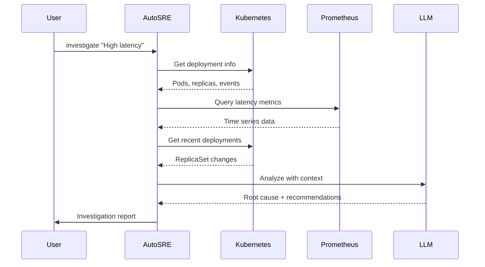

# Quickstart

Get AutoSRE running and investigate your first incident in 5 minutes.

## Prerequisites

- Python 3.11+ installed
- An LLM API key (Anthropic, OpenAI, or Ollama running locally)
- (Optional) kubectl configured for Kubernetes access

## Step 1: Install AutoSRE

```bash
pip install autosre
```

## Step 2: Set Up Your LLM Provider

=== "Anthropic (Recommended)"

    ```bash
    export ANTHROPIC_API_KEY="sk-ant-your-key"
    ```

=== "OpenAI"

    ```bash
    export OPENAI_API_KEY="sk-your-key"
    ```

=== "Ollama (Local)"

    ```bash
    # Install Ollama: https://ollama.ai
    ollama pull llama3.1:8b
    export OLLAMA_HOST="http://localhost:11434"
    ```

## Step 3: Initialize AutoSRE

```bash
autosre init
```

This creates:
- `.autosre/` — Data directory
- `runbooks/` — Sample runbooks
- `.env.example` — Configuration template

## Step 4: Run Your First Investigation

### CLI Investigation

```bash
autosre investigate "High CPU usage on payment-service in production"
```

### With More Context

```bash
autosre investigate \
  --service payment-service \
  --namespace production \
  --severity critical \
  "Error rate exceeded 5% threshold"
```

### Watch Mode (Live Incidents)

```bash
# Connect to Alertmanager/Prometheus
autosre watch --alertmanager http://localhost:9093
```

---

## Example Investigation

Here's what a typical investigation looks like:

```bash
$ autosre investigate "High latency on checkout-service"

🔍 Starting investigation...

┌─────────────────────────────────────────────────────────────┐
│                    Investigation Progress                    │
├─────────────────────────────────────────────────────────────┤
│ ✓ Checking service health...                                │
│ ✓ Fetching recent deployments...                            │
│ ✓ Analyzing metrics (latency, errors, traffic)...           │
│ ✓ Checking dependencies...                                  │
│ ✓ Correlating with recent changes...                        │
└─────────────────────────────────────────────────────────────┘

╭─────────────────────────────────────────────────────────────╮
│                    🔍 Investigation Report                   │
├─────────────────────────────────────────────────────────────┤
│ Alert: High latency on checkout-service                     │
│ Duration: 23 seconds                                        │
├─────────────────────────────────────────────────────────────┤
│ 🎯 Root Cause (confidence: 89%)                             │
│                                                             │
│ Database connection pool exhaustion. The checkout service   │
│ is waiting for available connections, causing request       │
│ queuing and latency spikes.                                 │
├─────────────────────────────────────────────────────────────┤
│ 📊 Evidence:                                                │
│ • P99 latency: 4.2s (baseline: 120ms)                       │
│ • DB connection wait time: 3.8s                            │
│ • Active connections: 50/50 (pool exhausted)               │
│ • Recent change: PR #1234 "Add product recommendations"    │
├─────────────────────────────────────────────────────────────┤
│ ✅ Recommended Actions:                                      │
│ 1. Increase connection pool size (temporary)               │
│    kubectl set env deployment/checkout-service \           │
│      DB_POOL_SIZE=100                                       │
│                                                             │
│ 2. Review and optimize the slow query in PR #1234          │
╰─────────────────────────────────────────────────────────────╯
```

---

## Try the Demo

AutoSRE includes a demo mode that simulates a realistic incident:

```bash
autosre demo
```

This runs through a simulated "database connection exhaustion" scenario, showing how AutoSRE:

1. Receives an alert
2. Gathers context from multiple sources
3. Correlates with recent changes
4. Identifies the root cause
5. Suggests remediation

---

## Quick Configuration

### Minimal Configuration

Create `~/.autosre/config.yaml`:

```yaml
# LLM Settings
llm:
  provider: anthropic
  model: claude-3-5-sonnet-20241022

# Autonomy level: observe | suggest | auto_safe | auto_all
agent:
  autonomy: suggest
```

### With Kubernetes

```yaml
llm:
  provider: anthropic
  model: claude-3-5-sonnet-20241022

agent:
  autonomy: suggest

integrations:
  kubernetes:
    enabled: true
    context: my-cluster  # or leave blank for default
    namespaces:
      - production
      - staging
```

### With Prometheus

```yaml
llm:
  provider: anthropic
  model: claude-3-5-sonnet-20241022

integrations:
  prometheus:
    enabled: true
    url: http://prometheus:9090
```

---

## Test with Different Alert Types

### Infrastructure Alert

```bash
autosre investigate \
  --service api-gateway \
  --namespace production \
  "Pod crash loop detected - OOMKilled"
```

### Performance Alert

```bash
autosre investigate \
  --service search-api \
  "P99 latency exceeded 2 seconds for 10 minutes"
```

### Availability Alert

```bash
autosre investigate \
  --service checkout-service \
  --severity critical \
  "Service returning 503 errors, health check failing"
```

---

## What Happens During an Investigation?



---

## API Quick Start

If you're running the full stack (Docker Compose or Helm), use the API:

### Start an Investigation

```bash
curl -X POST http://localhost:8000/api/v1/investigate \
  -H "Content-Type: application/json" \
  -H "X-API-Key: your-api-key" \
  -d '{
    "alert": {
      "title": "High error rate on payment-service",
      "severity": "critical",
      "labels": {
        "service": "payment-service",
        "namespace": "production"
      }
    }
  }'
```

Response:

```json
{
  "investigation_id": "inv_01HQ...",
  "status": "started",
  "stream_url": "/api/v1/investigate/inv_01HQ.../stream"
}
```

### Stream Progress

```bash
curl -N http://localhost:8000/api/v1/investigate/inv_01HQ.../stream
```

### Get Results

```bash
curl http://localhost:8000/api/v1/investigate/inv_01HQ...
```

---

## Next Steps

Now that you've run your first investigation:

1. **[Configure integrations](configuration.md)** — Connect your full observability stack
2. **[Set up Slack](../guides/slack-integration.md)** — Get notifications in your team channel
3. **[Create runbooks](../guides/custom-skills.md)** — Encode your team's knowledge
4. **[Deploy to production](../guides/kubernetes-deployment.md)** — Run AutoSRE in your cluster

---

## Troubleshooting

### "No LLM provider configured"

Set your API key:
```bash
export ANTHROPIC_API_KEY="sk-ant-..."
# or
export OPENAI_API_KEY="sk-..."
```

### "Cannot connect to Kubernetes"

Ensure kubectl is configured:
```bash
kubectl cluster-info
kubectl get pods  # Should work without errors
```

### Investigation is slow

- Check your LLM provider's rate limits
- Use a faster model for initial triage
- Reduce the number of data sources queried

### Need more help?

- 💬 [Slack Community](https://autosre.io/slack)
- 📖 [Troubleshooting Guide](../guides/troubleshooting.md)
- 🐛 [GitHub Issues](https://github.com/autosre/autosre/issues)
