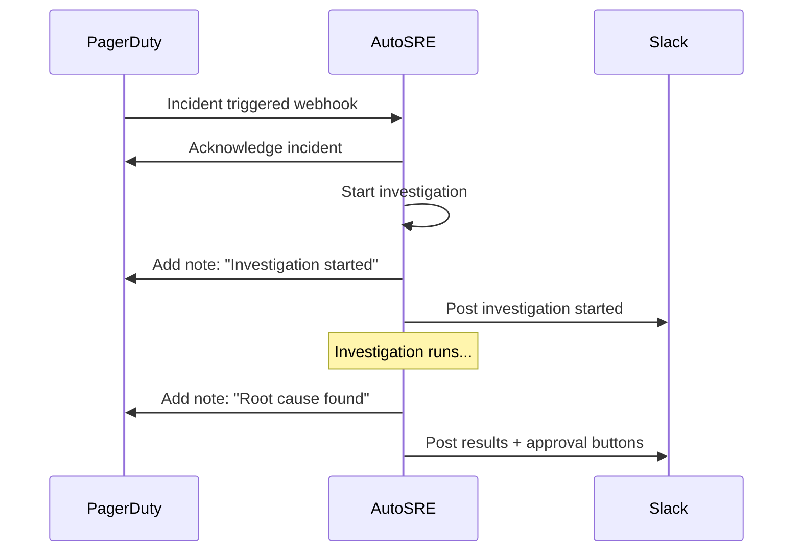

# PagerDuty Integration

Connect AutoSRE to PagerDuty for automatic alert ingestion and incident management.

## Features

- 🔔 **Automatic investigation** when incidents trigger
- ✅ **Auto-acknowledge** while investigating
- 📝 **Add notes** with investigation results
- 🔗 **Link to root cause** analysis

---

## Prerequisites

- PagerDuty account with API access
- Admin permissions to create integrations
- AutoSRE server accessible from internet (for webhooks)

---

## Step 1: Create API Key

1. Go to **Configuration** → **API Access Keys**
2. Click **Create New API Key**
3. Description: "AutoSRE"
4. Key type: **Full Access** (or scoped to incidents)
5. Click **Create Key**
6. Copy the API key

---

## Step 2: Configure AutoSRE

### Environment Variable

```bash
export PAGERDUTY_API_KEY="your-api-key"
```

### Configuration File

```yaml
# autosre.yaml
integrations:
  pagerduty:
    enabled: true
    
    # Services to monitor (empty = all)
    service_ids:
      - "P123ABC"
      - "P456DEF"
    
    # Auto-acknowledge when starting investigation
    auto_acknowledge: true
    
    # Add investigation notes to incident
    add_notes: true
    
    # Priority threshold (only investigate P1/P2)
    min_priority: "P2"
```

---

## Step 3: Set Up Webhooks (Optional)

For real-time incident ingestion:

### Create Extension

1. Go to **Services** → select your service
2. Click **Integrations** tab
3. Click **Add another integration**
4. Search for **Generic V3 Webhooks**
5. Click **Add**

### Configure Webhook

1. Integration URL:
   ```
   https://your-domain.com/api/v1/webhook/pagerduty
   ```

2. Events to subscribe:
   - `incident.triggered`
   - `incident.acknowledged`
   - `incident.resolved`

---

## Step 4: Verify Integration

### Check Connection

```bash
autosre integrations test pagerduty
```

Output:
```
PagerDuty Integration
✓ API connection successful
✓ Can list incidents
✓ Webhook endpoint reachable
  
Services monitored: 3
  - checkout-service (P123ABC)
  - payments-api (P456DEF)
  - orders-service (P789GHI)
```

### Test Webhook

```bash
curl -X POST http://localhost:8000/api/v1/webhook/pagerduty/test
```

---

## How It Works



---

## Usage

### Automatic Investigation

When an incident triggers:

1. AutoSRE receives webhook
2. Acknowledges incident (if configured)
3. Starts investigation
4. Posts results to Slack
5. Adds notes to PagerDuty incident

### Manual Investigation

```bash
# Investigate specific incident
autosre investigate --pagerduty-incident P123456

# Or via API
curl -X POST http://localhost:8000/api/v1/investigate \
  -H "Content-Type: application/json" \
  -d '{
    "source": "pagerduty",
    "incident_id": "P123456"
  }'
```

---

## Incident Notes

AutoSRE adds structured notes to incidents:

```
🔍 AutoSRE Investigation Started
Investigation ID: inv_01HQ7X9A2B3C4D5E6F
Started: 2025-01-27T10:30:00Z
───────────────────────────────

🎯 Root Cause Identified (92% confidence)

Database connection pool exhaustion caused by query
introduced in deployment checkout-v2.3.1.

Evidence:
• P99 latency: 4.2s (baseline: 120ms)
• DB connections: 50/50 (exhausted)
• Deployment: v2.3.0 → v2.3.1 (23 min ago)

Recommended Action:
kubectl rollout undo deployment/checkout-service

Full report: https://autosre.example.com/inv/inv_01HQ...
```

---

## Configuration Options

```yaml
integrations:
  pagerduty:
    enabled: true
    
    # API settings
    api_url: "https://api.pagerduty.com"  # Default
    
    # Services to monitor
    service_ids: []  # Empty = all services
    
    # Priority filter
    min_priority: "P3"  # P1, P2, P3, P4, P5
    
    # Behavior
    auto_acknowledge: true  # ACK when starting investigation
    add_notes: true         # Add investigation notes
    
    # Urgency filter
    urgencies:
      - "high"
      - "low"
    
    # Time filter (optional)
    business_hours_only: false
    timezone: "America/Los_Angeles"
```

---

## Troubleshooting

### Webhooks Not Received

1. Check webhook URL is accessible from internet
2. Verify service has webhook extension configured
3. Check AutoSRE logs for incoming requests:
   ```bash
   autosre logs --filter pagerduty
   ```

### API Connection Failed

1. Verify API key is correct
2. Check key has required permissions
3. Test connection:
   ```bash
   curl -H "Authorization: Token token=$PAGERDUTY_API_KEY" \
     https://api.pagerduty.com/incidents?limit=1
   ```

### Incidents Not Being Investigated

1. Check `service_ids` filter
2. Verify `min_priority` threshold
3. Check incident matches filter criteria

---

## Security

1. **Use restricted API key** with minimal permissions
2. **Verify webhook signatures** (if using V3 webhooks)
3. **Rotate API keys** regularly
4. **Audit investigation actions** via logs

---

## Next Steps

- [Slack Integration →](slack-integration.md)
- [Custom Skills →](custom-skills.md)
- [Configuration Reference →](../reference/configuration.md)
