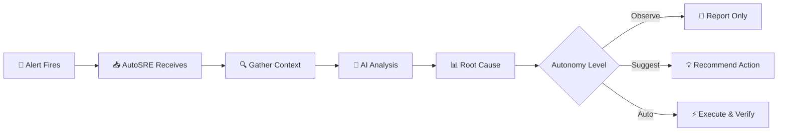

<style>
  .md-typeset h1 { display: none; }
  .hero { text-align: center; padding: 2rem 0; }
  .hero h1 { font-size: 3rem; margin-bottom: 1rem; }
  .hero p.lead { font-size: 1.25rem; color: var(--md-default-fg-color--light); }
  .features { display: grid; grid-template-columns: repeat(auto-fit, minmax(280px, 1fr)); gap: 1.5rem; margin: 2rem 0; }
  .feature { padding: 1.5rem; background: var(--md-code-bg-color); border-radius: 8px; }
  .feature h3 { margin-top: 0; display: flex; align-items: center; gap: 0.5rem; }
  .cta-buttons { display: flex; gap: 1rem; justify-content: center; flex-wrap: wrap; margin: 2rem 0; }
  .cta-buttons a { padding: 0.75rem 2rem; border-radius: 4px; text-decoration: none; font-weight: 500; }
  .cta-primary { background: var(--md-primary-fg-color); color: white !important; }
  .cta-secondary { border: 2px solid var(--md-primary-fg-color); color: var(--md-primary-fg-color) !important; }
</style>

<div class="hero">
  
  <h1>AutoSRE</h1>
  <p class="lead">
    AI-powered Site Reliability Engineering agent that autonomously investigates<br/>
    production incidents, correlates signals, and recommends remediation.
  </p>
  
  <div class="cta-buttons">
    <a href="getting-started/quickstart/" class="cta-primary">Get Started →</a>
    <a href="https://github.com/autosre/autosre" class="cta-secondary">View on GitHub</a>
  </div>
</div>

---

## Why AutoSRE?

On-call engineers spend **70% of incident time gathering context** — checking dashboards, correlating logs, reviewing recent changes. AutoSRE automates this investigation, reducing Mean Time to Resolution (MTTR) by **60%+**.

<div class="features">
  <div class="feature">
    <h3>🔍 Autonomous Investigation</h3>
    <p>AI agent that thinks like a senior SRE — checks metrics, logs, traces, and recent deployments to identify root causes.</p>
  </div>
  
  <div class="feature">
    <h3>🧠 Episodic Memory</h3>
    <p>Learns from past incidents. When similar issues occur, AutoSRE recalls what worked before and applies proven solutions.</p>
  </div>
  
  <div class="feature">
    <h3>🔗 Multi-Signal Correlation</h3>
    <p>Connects the dots across Kubernetes, cloud providers, APM tools, and logs to find the actual root cause.</p>
  </div>
  
  <div class="feature">
    <h3>🛡️ Human-in-the-Loop</h3>
    <p>Configurable autonomy levels. Observe, suggest, or auto-remediate — you stay in control of what gets executed.</p>
  </div>
  
  <div class="feature">
    <h3>📊 Knowledge Graph</h3>
    <p>Maps your service topology and dependencies. Understands blast radius and upstream/downstream impact.</p>
  </div>
  
  <div class="feature">
    <h3>🔌 46+ Integrations</h3>
    <p>Works with Kubernetes, AWS, GCP, Datadog, Prometheus, PagerDuty, Slack, and more out of the box.</p>
  </div>
</div>

---

## How It Works



1. **Alert triggers** from PagerDuty, Alertmanager, or webhooks
2. **Context gathered** from Kubernetes, metrics, logs, and recent changes
3. **AI analyzes** using LLM reasoning with structured tool calling
4. **Root cause identified** with confidence scoring
5. **Action taken** based on your autonomy settings

---

## Quick Example

```bash
# Start an investigation from the CLI
autosre investigate "High error rate on checkout-service"

# Or trigger via API
curl -X POST http://localhost:8000/api/v1/investigate \
  -H "Content-Type: application/json" \
  -d '{
    "alert": {
      "title": "High error rate on checkout-service",
      "severity": "critical",
      "labels": {"service": "checkout-service", "namespace": "production"}
    }
  }'
```

**Sample Output:**

```
╭─────────────────────────────────────────────────────────────╮
│                    🔍 Investigation Report                   │
├─────────────────────────────────────────────────────────────┤
│ Alert: High error rate on checkout-service                  │
│ Duration: 45 seconds                                        │
├─────────────────────────────────────────────────────────────┤
│ 🎯 Root Cause (confidence: 92%)                             │
│                                                             │
│ Database connection pool exhaustion caused by a query       │
│ introduced in deployment checkout-v2.3.1 (deployed 23m ago) │
├─────────────────────────────────────────────────────────────┤
│ 📊 Evidence:                                                │
│ • Error rate: 12.5% (normally < 0.5%)                       │
│ • DB connection wait time: 15s (normally < 100ms)          │
│ • Recent deployment: checkout-v2.3.0 → v2.3.1              │
│ • Commit: "Add new product recommendations query"          │
├─────────────────────────────────────────────────────────────┤
│ ✅ Recommended Action:                                       │
│ kubectl rollout undo deployment/checkout-service           │
╰─────────────────────────────────────────────────────────────╯
```

---

## Key Features

### 🤖 LangGraph-Based Agent

Built on [LangGraph](https://langchain-ai.github.io/langgraph/) for reliable, structured reasoning:

- **Triage** → Initial alert classification
- **Investigate** → Deep dive into metrics, logs, traces
- **Correlate** → Connect signals across systems
- **Remediate** → Execute actions with guardrails
- **Report** → Generate human-readable summaries

### 🔒 Security First

- **Non-root containers** with read-only filesystems
- **Secrets management** via Vault or Kubernetes secrets
- **Audit logging** for all automated actions
- **Role-based access control** for teams

### 📈 Observable

- **Prometheus metrics** for investigation performance
- **OpenTelemetry traces** for debugging
- **Structured JSON logging** for analysis

---

## Integrations

AutoSRE connects to your existing stack:

| Category | Integrations |
|----------|--------------|
| **Alerting** | PagerDuty, Alertmanager, OpsGenie, Datadog |
| **Kubernetes** | kubectl, Helm, ArgoCD, Flux |
| **Cloud** | AWS, GCP, Azure |
| **Observability** | Prometheus, Datadog, Dynatrace, New Relic |
| **Logs** | Elasticsearch, Splunk, Loki |
| **APM** | Datadog APM, Jaeger, Tempo |
| **CI/CD** | GitHub Actions, GitLab CI, Jenkins |
| **Chat** | Slack, Microsoft Teams, Discord |

---

## Getting Started

<div class="features" style="grid-template-columns: repeat(auto-fit, minmax(200px, 1fr));">
  <div class="feature">
    <h3>📦 Install</h3>
    <p>pip, Docker, or Helm</p>
    <a href="getting-started/installation/">Installation Guide →</a>
  </div>
  
  <div class="feature">
    <h3>🚀 Quickstart</h3>
    <p>5 minutes to first investigation</p>
    <a href="getting-started/quickstart/">Quickstart Guide →</a>
  </div>
  
  <div class="feature">
    <h3>⚙️ Configure</h3>
    <p>Connect your integrations</p>
    <a href="getting-started/configuration/">Configuration Guide →</a>
  </div>
</div>

---

## Community

- 💬 [Slack Community](https://autosre.io/slack) — Chat with other users
- 🐛 [GitHub Issues](https://github.com/autosre/autosre/issues) — Report bugs
- 💡 [Discussions](https://github.com/autosre/autosre/discussions) — Feature requests
- 📖 [Contributing](development/contributing/) — Help improve AutoSRE

---

## License

AutoSRE is open source under the [Apache 2.0 License](https://github.com/autosre/autosre/blob/main/LICENSE).
